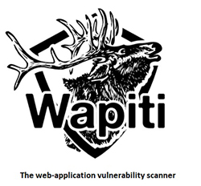

## TP5 Testing - IOT (UBA)

Autor:
* Iván Cruz Flores

Docentes:

* Esp. Ing. Estevan Volentini.
* Esp. Ing. Alejandro Permingeat.
* Carlos Pantelides.

## TEMA: Aplicación de técnicas de testing web 

* Dentro del Master Test Plan se planificó aplicar la técnica de "State Transition Testing". 
* En el presente práctica se enfoca en aplicar un ejemplo de caja negra para la función de Login del sistema del TP final.

## State Transition Testing:
es un tipo de prueba de software que se realiza para verificar el cambio en el estado de la aplicación con una entrada variable. Se cambia la condición de entrada pasada y se observa el cambio de estado.

State Transition Testing es básicamente una técnica de prueba de "caja negra" que se lleva a cabo para observar el comportamiento del sistema o aplicación para diferentes condiciones de entrada pasadas en una secuencia.


## Práctica de estudio:

# Modificación al Master Test Plan

Agregar una característica a determinar al master test plan y desarrollar una acción de test de un test case sencillo de esta característica.

Se solicita entregar:

* Documento Master Test Plan modificado.
* Documento con el desarrollo de la acción de test.


En la siguiente imagen se muestra las capas usadas en la aplicación de prueba.


# Herramienta usada:

# Wapiti: 

Es ana herramienta que realiza pruebas de caja negra al escanear páginas web e inyectar datos. Intenta inyectar cargas y ver si un script es vulnerable. Es compatible con los ataques GET y POSTHTTP y detecta múltiples vulnerabilidades.



Enlace oficial: https://wapiti.sourceforge.io/


```
 En el siguiente video se muestra el Funcionamiento de lo aplicado durante la práctica:
```
 https://youtu.be/UMlD7U_ij_w

## Dependencias:
```
* Python 3.7
* Python pip.
* Wapiti Scanner.
```
